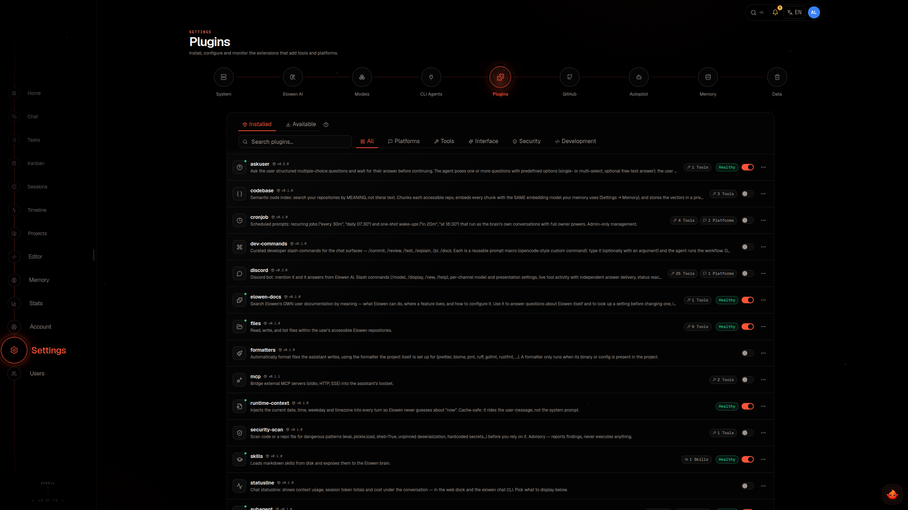

# Plugins

Elowen is a personal AI agent you chat with — and almost everything that agent can
*do* arrives as a plugin. Chat platforms, tools, skills, memory, automation,
security checks, even the little status line under the chat: each is a
self-contained module you can add or remove. Elowen is modular to the core.

That is the third pillar in practice. The agent's capabilities are not baked in;
they are composed. You decide which platforms it answers on, which tools it may
call, and which extras it loads — and you can change your mind without touching
the codebase.



## Everything is a plugin

Plugins register their capabilities with the brain (the embedded agent core you
talk to — see [Brain & Chat](brain-chat)) at runtime. Elowen ships fifteen
bundled plugins out of the box: the platforms **discord** and **whatsapp**; the
tools **files**, **terminal**, **mcp**, **subagent**, **askuser** and the
optional **codebase** (semantic code search, off by default); automation
via **cronjob**; the surface extras **statusline** and **runtime-context**;
**security-scan**; and the authoring/workflow set **skills**, **formatters** and
**dev-commands**.

In the marketplace you can filter by **category** — a lightweight display
grouping derived from what each plugin declares (a chat platform → *platforms*)
and its name, not a capability system:

| Category | What it covers |
|----------|--------------|
| **platforms** | Chat surfaces the agent lives on — Discord, WhatsApp |
| **tools** | General actions — mcp, askuser, and the rest |
| **memory** | Long-term recall of events and facts |
| **automation** | Scheduled and recurring work — cronjob |
| **ui** | Chat-surface extras — statusline |
| **security** | Advisory safety checks — security-scan |
| **development** | Authoring & code workflow — files, terminal, skills, formatters, dev-commands |

Manage them all in **Settings → Plugins**. Every plugin has a toggle, its own
config form, a detail page (with a hero illustration, its live tools, hooks and a
derived permissions summary), and a remove action — bundled plugins are hidden
and stop loading but stay on disk (restorable from the Available tab), while ones
you installed yourself are uninstalled outright.

## The marketplace

Bundled plugins ship with Elowen, but you are not limited to them. Elowen includes a
**plugin marketplace**: a curated registry you browse from **Settings →
Plugins** to install, update, and uninstall extra plugins.

- **Browse** — the catalog lists each plugin with its name, category, a short
  description, and how much it *provides* (counts of tools, skills, and
  platforms), so you know what you're adding before you add it.
- **Install** — one click pulls the plugin into your user plugins and loads it
  live.
- **Update** — when a newer version is published, the entry shows
  *update available*; updating swaps it in place.
- **Uninstall** — a plugin you installed is removed outright (its folder and data
  are deleted). A bundled plugin can't be deleted from disk — removing it instead
  *soft-removes* it: it disappears from the installed list and stops loading, but
  its files stay, so you can restore it from the **Available** tab any time.

The marketplace only offers install/update on plugins it owns, never on the
built-ins. Installs are allowed only for names the registry publishes, so the
trust surface is simply "do you trust this registry", the same posture as the
Elowen package itself. If the registry can't be reached (offline, for example), the
UI tells you the marketplace is unavailable rather than pretending the catalog is
empty.

## Plugin anatomy

A plugin is a directory with a manifest and an ESM entry point:

```
plugins/<name>/
├── orca-plugin.json    # name, version, apiVersion, entry, provides, configSchema
└── index.mjs           # exports register(ctx) — ESM only
```

### Manifest fields

| Field | Required | Description |
|-------|----------|-------------|
| `name` | ✓ | Plugin identifier (kebab-case) |
| `version` | ✓ | Semver, used for update detection |
| `apiVersion` | ✓ | Plugin API version — must equal `1` or the loader skips the plugin |
| `description` | ✓ | One-line summary shown in the UI |
| `entry` | ✓ | Entrypoint relative path (e.g. `index.mjs`) |
| `provides.tools` / `.platforms` / `.skills` / `.hooks` | | Declarative hints of what the plugin contributes |
| `requires.config` / `.env` | | Config keys / env vars required before the plugin activates |
| `configSchema` | | Field schema that renders the settings form |
| `capabilities` | | What the plugin is allowed to do — deny-by-default (see below) |
| `icon` | | Brand icon (SVG, defaults to `icon.svg`) shown on cards and the hero |
| `icons` | | Per-tool emoji shown in the chat clients' tool-call lines |
| `showOutput` | | Tool names (or `prefix*` patterns) whose *successful* output is shown in the transcript — output is hidden by default |

`provides` is declarative — display and validation hints. The authoritative
contributions come from `register(ctx)` at load time, so the detail page's Tools
and Hooks panels show what actually went live, not just what the manifest
promised.

**Tool-output visibility.** A tool's successful output is hidden in the chat
transcript by default — noise like file reads, directory listings and searches
would otherwise bury the answer, and hiding it is what lets a client collapse
repeated calls into one `Read … ×N` line. A plugin opts a tool *in* by listing
its name in `showOutput`; the same allowlist is honoured by every client (CLI,
web, Discord). A tool that stays hidden still surfaces its *failures* and any
hook-appended note — only clean success output is suppressed.

### Config field types

The `configSchema` array is the whole settings form — the UI renders one control
per field, in declared order. When the schema declares `section` headers, each
section becomes its own collapsible panel; otherwise fields are auto-bucketed
into connection/behaviour groups.

| Type | Renders as |
|------|-----------|
| `string` / `textarea` | Single-line / multi-line text |
| `secret` | Write-only password field — the API only reports *whether* it's set |
| `boolean` | Toggle |
| `number` | Numeric input honouring `min`, `max` and `step` |
| `enum` | Single choice from `options` (segmented control) |
| `multiSelect` | Multiple choices from `options` |
| `model` / `embeddingModel` | Grouped provider→model picker from your catalog |
| `provider` | Picker of configured brain providers (reuses that provider's key); `providerType` narrows it to one type |
| `code` / `prompt` | Monaco editor (`language` sets the syntax mode; `prompt` is markdown) |
| `json` | JSON blob, validated as you type — a malformed value never saves |
| `rolePolicies` | Structured role → projects + prompt + tool-allowlist editor (Discord/WhatsApp) |
| `mcpServers` | List editor for external MCP server specs |
| `section` | A labelled group header carrying no value |

Presentation props any field can add: `hint` (one-line) and `help` (a richer
tooltip), `required`, `risk` (`low`/`medium`/`high`, surfaced as a badge), and
`visibleWhen` (show the field only when another field equals a given value).

**Number bounds and defaults.** Numeric fields carry `min`/`max`/`step` so the
input can't drift out of a sane range — e.g. the cronjob tick interval is clamped
to `10000–120000` ms in `5000`-ms steps. A field's `default` is the value the
form pre-fills on a fresh install, and it always mirrors the plugin's own runtime
fallback, so the pre-filled number never silently changes behaviour. Examples:
the files plugin defaults its read cap to `100000` characters, terminal's command
timeout to `120000` ms, and MCP's tool-call timeout to `120000` ms.

### Capabilities & permissions

A plugin's `capabilities` block is a **deny-by-default** contract: a manifest with
no capabilities can mutate nothing. It gates runtime hook patches — `mutates`
lists what a hook may change (`prompt`, `turnContext`, `tools`, `memory`; only
`turnContext` is patch-wired today), `network` is declared intent, and `reads`
lists read scopes the plugin claims. The detail page's **Permissions** panel
surfaces all of this alongside a derived risk level (from secrets, network reach
and tool count) and the list of required credentials/config, so you can see a
plugin's blast radius before you trust it.

## Registry API (`ctx`)

The `register(ctx)` function receives a context object — the plugin's entire
contract with the agent:

| Method | Purpose |
|--------|---------|
| `ctx.registerTool(tool)` | Add a tool to the brain's toolset |
| `ctx.registerPlatform(platform)` | Add a chat platform adapter |
| `ctx.registerSkill(skill)` | Register an inline skill |
| `ctx.registerTurnContext(fn, options?)` | Inject per-turn context before user text (default) or after it |
| `ctx.dataDir()` | Writable per-plugin data directory |
| `ctx.config` | Current config values |
| `ctx.logger` | Plugin-scoped logger |
| `ctx.isAdminSession()` | Is the current user an admin? |
| `ctx.assertPathAllowed(path)` | Security path guard for file access |

## Hot-reload

You don't restart the daemon to reconfigure your agent. Enabling, disabling, or
saving a plugin's config triggers a **hot-reload** — the change applies to
running conversations immediately. This keeps the second pillar honest: changing
what the agent can do is low-friction and low-risk.

## Platforms: Discord & WhatsApp

Platform plugins are where you actually meet the agent. You write; it answers
from Elowen AI, streams its work, and pushes to you proactively.

### Discord

A full Discord bot (no external client library — it uses Node's native
WebSocket and fetch against the v10 Gateway). By default it answers every message
in channels it can see; flip **Respond without mention** off and it only replies
when `@mentioned`.

- Slash commands: `/model`, `/voice`, `/new`, `/stop`, `/status`, `/compact`, `/help`
- Per-channel model picker (operator-gated)
- Streamed replies in **two separate messages** — the answer streams live into
  its own bubble (a real reply to your message), kept apart from the tool-call
  trace bubble, so the answer is never buried under the tool steps
- Status reactions (👀 → ✅ / ❌) and an optional runtime footer
- Image attachments → vision input (with an optional dedicated vision model);
  optional Whisper transcription of voice messages and TTS spoken replies
  (reusing a configured OpenAI-compatible provider's key)
- Proactive cron/tick pushes into a notification channel
- A large **server toolset** for admin sessions — channels, roles, members,
  threads, pins, and messages

Each Discord role maps to a set of allowed Elowen projects, a role prompt and the
tools the bot may use for it, so who can reach which project is policy, not luck.
The first matching role wins; members with no mapped role are silently ignored.
Configure in **Settings → Plugins → discord**.

### WhatsApp

Talk to Elowen from WhatsApp, powered by Baileys. Write a message and it answers
from Elowen AI.

- Text commands: `/model`, `/new`, `/help`
- Per-chat model menu — a numbered list you reply to with a number
- Edit-in-place streaming replies with the agent's tool trace
- Status reactions and a small runtime footer
- Proactive pushes (cron/tick results, escalations, restart notices) to a chat
  you nominate
- **Group tools** for admin sessions — list and inspect groups, create groups,
  add/remove members, and send to any chat

Each sender — a phone number, a JID, or a whole group — maps to allowed projects
and a role prompt, and a policy can further restrict which tools the bot may use
for it. Pair the bot by scanning a **QR code** from the plugin logs, or set a
`phoneNumber` to get an 8-character **pairing code** instead. Configure in
**Settings → Plugins → whatsapp**.

## Tools: files, terminal, mcp, subagent, askuser, codebase

Tools are the verbs of your agent. Which ones a given user's agent may call is
governed by RBAC — an admin can grant one user the terminal and files tools and
give another only chat, per user, via `disabled_tools`. See
[Account & Security](account-security).

### files

File-system access scoped to your Elowen projects:

| Tool | Purpose |
|------|---------|
| `read_file` | Read file contents |
| `write_file` | Write or overwrite a file |
| `edit_file` | Targeted edit with a diff display |
| `list_dir` | List directory contents |
| `search_files` | Search for content across files |
| `file_info` | Metadata about a file |
| `git_status` | The repo's git status |

Every path is guard-checked against the user's allowed project roots — the agent
can't wander outside repos you gave it. Read and search output is capped (default
100k characters / 200 matches) so a huge file can't blow up a turn.

### terminal

Shell execution, scoped to the accessible repo:

| Tool | Purpose |
|------|---------|
| `run_command` | Run a foreground command (CWD = repo) |
| `list_processes` | List background processes |
| `read_process_output` | Read a background process's output |
| `kill_process` | Kill a background process |

Foreground commands show output inline; background processes persist across
turns. In shared-channel platforms (like Discord) these tools are owner-only.

### mcp

Bridge external **MCP servers** into the agent's toolset. Add servers in the
plugin config and choose a transport per server: **stdio** launches a local
process (e.g. `npx …`), while **HTTP** or **SSE** connect to a remote URL. stdio
servers run in their own process group and are cleaned up as a group on reload,
so child processes are never orphaned. Their tools appear alongside the built-in
ones.

### subagent

| Tool | Purpose |
|------|---------|
| `delegate` | Spawn a fresh, isolated sub-agent for a focused subtask |
| `delegate_models` | List the models a delegated sub-agent can run on |

The sub-agent inherits exactly the caller's access — never more — and returns
its result to the parent. Good for keeping a long task's context clean.

### askuser

| Tool | Purpose |
|------|---------|
| `ask_user_question` | Pose structured questions and wait for the answer |

When the agent needs a decision from you, it asks — one or more questions with
predefined options (single- or multi-select, with an optional free-text answer).
You pick in the chat (CLI/web), via Discord buttons/selects, or with a numbered
WhatsApp reply, and the turn resumes with your choice.

### codebase

Semantic code search over your accessible repositories — it finds code and docs
by *meaning*, not literal text, so you can ask "where do we verify a JWT" and get
the relevant code even without knowing the identifier. It complements the files
plugin's literal `search_files`. **This plugin is off by default** — enable it in
**Settings → Plugins**.

| Tool | Purpose |
|------|---------|
| `codebase_search` | Rank the most relevant chunks for a natural-language query |
| `codebase_reindex` | Refresh the index (incremental by default; `full` rebuilds) — admin only |
| `codebase_status` | Report per-repo coverage: chunk/file counts, last-indexed time, and whether the index is stale |

The plugin chunks each accessible repo and embeds every chunk with the **same
embedding model your memory uses** (**Settings → Memory** is the single source of
truth — there is no separate model to set here). Vectors live in a private,
per-repo SQLite index in the plugin's own data directory
(`<plugins-data>/codebase/index.db`); it never touches the user memory store.
Search is confined to the session's repos, guard-checked on every returned path,
so results never leak code from a repo you can't reach.

Building or refreshing the index writes shared state and spends the embedding
provider, so **`codebase_reindex` is admin-only**. With *Auto-reindex on search*
on (the default), an admin's search lazily refreshes a stale repo in the
background — so you rarely call reindex by hand. Search itself needs an embedding
model configured; without one it tells you to set it in **Settings → Memory**.
Include/exclude globs, chunk size, results per search, the relevance floor, and
the per-pass embed budget are all tunable in **Settings → Plugins → codebase**.

## Automation: cronjob

Scheduled work for the agent (admin-only). Cron jobs are prompts that run as the
brain's *own* conversations — the agent wakes up, does the work, and reports.

**Schedule formats:**

| Pattern | Example | Recurring |
|---------|---------|-----------|
| Every N minutes | `every 30m` | ✓ |
| Every N hours | `every 2h` | ✓ |
| Daily at time | `daily 07:30` | ✓ |
| Weekly on day | `weekly mon 09:00` | ✓ |
| In N minutes | `in 15m` | One-shot |
| At time today | `at 18:30` | One-shot |

- **Active-hours window** — a guard like `5-21` or `22-5` (overnight wrap)
- **Per-job model override** — run a job on a different model than the default
- **Guard command** — a cheap shell gate that skips the LLM unless output matches
- **Silent replies** — a `NOTHING_TO_REPORT` result is suppressed, no noise
- **Target channel** — route results to a specific chat/thread

Configure in **Settings → Plugins → cronjob**.

## Security: security-scan

An advisory static scanner — the safety-conscious pillar in a small package.

| Tool | Purpose |
|------|---------|
| `scan_code` | Scan files for dangerous patterns |

It flags patterns like `eval`, `pickle.load`, `shell=True`, unpinned
deserialization, and hardcoded secrets, classifying findings as `danger` or
`warn`. It **reports** — it never executes anything.

## Development: skills, formatters & dev-commands

### skills

Loads Markdown **skills** from disk and exposes them to the agent so it can pull
in focused, reusable know-how on demand (`read_skill`, `create_skill`,
`list_skills`, `delete_skill`).

- **Bundled skills** ship with Elowen and are read-only
- **User skills** are created with the `create_skill` tool or the Settings editor
- **Format** — Markdown with YAML frontmatter (`name`, `description`)
- **Hot-reload** — new or changed skills apply to new conversations immediately

Configure in **Settings → Plugins → skills**.

### formatters

Runs the project's own formatter right after the agent writes or edits a file, so
generated code lands already tidy. It hooks `tools.call.after` and picks the
formatter the repo is actually set up for — prettier, biome, Laravel Pint, ruff,
gofmt, rustfmt, clang-format, `mix format`, `terraform fmt`, shfmt — running one
only when its binary or config is present. Auto-formatting is on by default; you
can switch it off entirely, disable specific formatters, or tune the subprocess
timeout and file-size cap in its config.

### dev-commands

A set of opt-in developer slash-commands for the chat surfaces — `/commit`,
`/review`, `/test`, `/explain`, `/pr`, `/docs`. Each is a reusable prompt macro:
type it (optionally with an argument) and the agent runs that workflow. Pick which
to expose in the config (leave the list empty to enable them all).

## UI: statusline & runtime-context

Small surface extras that keep the chat honest and grounded — the clarity
pillar.

**statusline** prints a footer under the chat — in the web dock and the `elowen`
chat CLI — with what you choose to show. Every metric is off by default; switch
on the ones you want:

| Metric | Description |
|--------|-------------|
| Model | Current model name |
| Context | Context-window fill percentage |
| Tokens | Total tokens used this session |
| Cost | Running cost estimate (subscriptions report $0) |

**runtime-context** injects the current date, time, weekday, and timezone into
every turn, so the agent never guesses about "now". It's cache-safe — it rides
the user message, not the system prompt. Set the timezone in its config (default
`Europe/Prague`).

## Memory

Long-term memory — the agent remembering events and facts across conversations
— is a capability you configure under **Settings → Memory** (and the related
plugin controls). For how automatic recall, conscious save, and the "glass
brain" view work in a chat, see [Brain & Chat](brain-chat). For the settings
themselves, see [Configuration](configuration).

---

Which plugins your agent runs, and which of their tools each *user* may call, is
exactly the kind of thing Elowen's RBAC lets you tune per person. To see the whole
agent from the outside — dashboards, sessions, and the Plugins screen — read
[Web UI](web-ui).

[Next: Projects & Workflow](projects-workflow)
